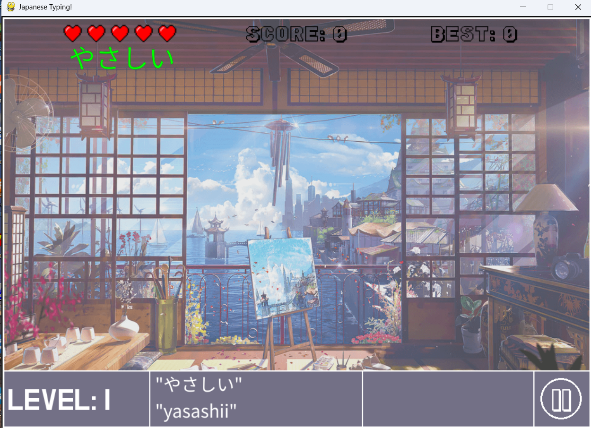
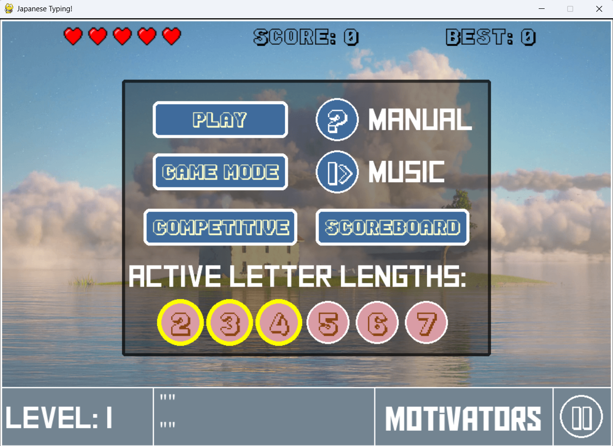
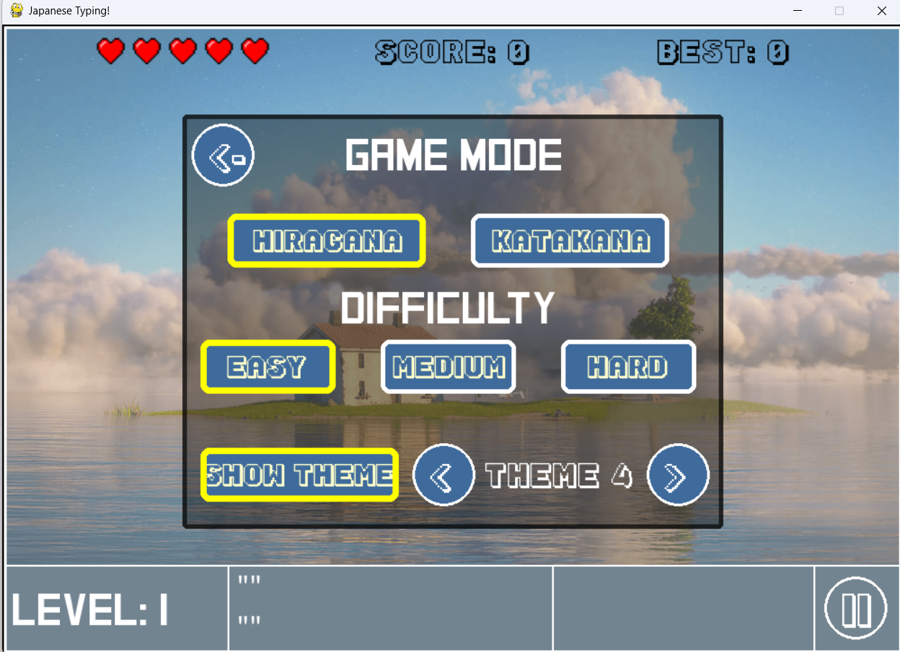
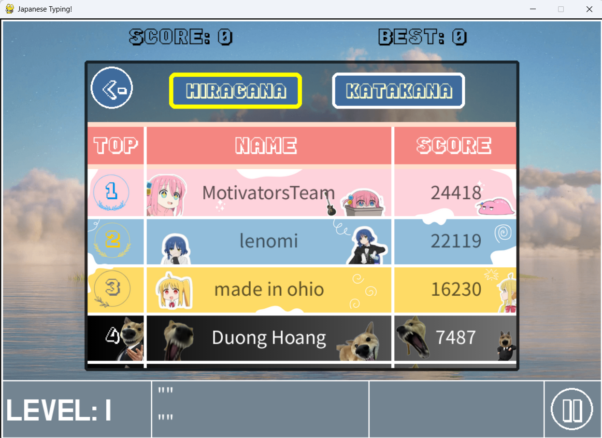

# Japanese Typing!

A small typing game built with Python and Pygame to make practising Japanese vocabulary more interactive. Type the romaji for each moving Japanese word before it leaves the screen.



## Features

- Practise both **Hiragana** and **Katakana** vocabulary.
- Choose word lengths from **2 to 7 characters** and one of three difficulty levels: Easy, Medium, or Hard.
- Use **Learn mode** to see each word together with its romaji reading.
- Progress through increasingly busy levels while managing five lives.
- Build typing combos for bonus points and review correctly answered or missed words after a game.
- Switch between six visual themes and control the background-music playlist and volume.
- View and submit scores to separate online Hiragana and Katakana leaderboards.

## How to play

Type the romaji that matches a word on screen, then press `Enter` or `Space` to submit it. A correct answer removes the word; an incorrect answer breaks the current combo. A life is lost when a word travels off screen. Press `Esc` or the pause button to open the menu.

## Run locally

```bash
python -m pip install pygame requests
python main.py
```

Run the command from the project root so the game can find the files in `assets/`. An internet connection is only required for the online leaderboard.

## Screenshots

| Main menu | Game settings |
| --- | --- |
|  |  |

| Gameplay | Leaderboard |
| --- | --- |
|  |  |

## Tech stack

- Python
- Pygame
- Requests (desktop leaderboard access)
